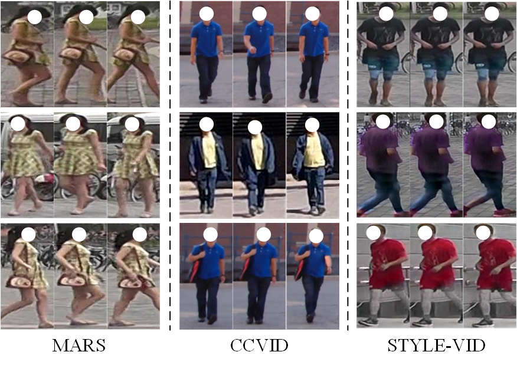

# STYLE-VID
A synthetic video dataset for long-term person re-ID

## Two Samples of the dataset

## Comparison with other datasets
As analyzed in the paper, long-term Re-ID in video is closer to human awareness in real-world Re-ID scenarios. Moreover, the rich spatio-temporal information in video is helpful for long-term Re-ID. However, Research on long-term Re-ID in video is still in its infancy. To our knowledge, CCVID is the unique existing publicly available long-term video dataset. Nevertheless, the dataset size is fairly small and all videos are captured from a frontal perspective, which cannot satisfy our research on a generalized long-term Re-ID model.

## The Process of Dataset Production

